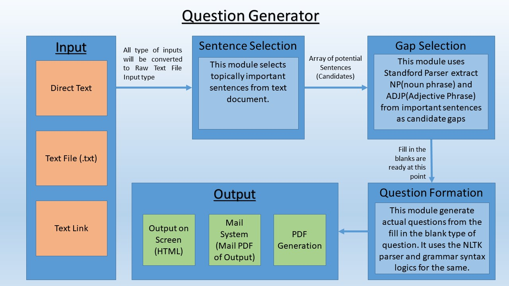

# [Question Generator](https://github.com/adityasarvaiya/Automatic_Question_Generation)

Learning to generate questions from text.<br>
Blog on this project : </br>
[Link1 : https://software.intel.com/en-us/articles/using-natural-language-processing-for-smart-question-generation](https://software.intel.com/en-us/articles/using-natural-language-processing-for-smart-question-generation) </br>
[Link2 : http://dynamichub.in/aditya/sqg/](http://dynamichub.in/aditya/sqg/)



## Strategy

- Sentence Selection: This module selects topically important sentences from text document.
- Gap Selection: This module uses Standford Parser extract NP(noun phrase) and ADJP(Adjective Phrase) from important sentences as candidate gaps.
- Question Formation: This module generate actual questions from the fill in the blank type of question. It uses the NLTK parser and grammar syntax logics for the same.
- Question Classification: Classify question quality based on pre-trained SVM classifier (Conditional trained only for Blank type questions)


## Build

### Build Project

```bash
Install Python2.7`in your system
```

```bash
git clone https://github.com/adityasarvaiya/Automatic_Question_Generation.git
```

```bash 
cd Automatic_Question_Generation 
```

```bash
pip install -r requirements.txt
```
if you have problem with dotenv package then uninstall dotenv and install python-dotenv

```bash
pip install nltk
python 
import nltk
nltk.download("punkt")
nltk.download("stopwords")
nltk.download("averaged_perceptron_taggepython r")
```

### Build Stanford Parser & NER

- Create a folder to host all the stanford models, e.g. `mkdir /your-path-to-stanford-models/stanford-models`.
+ Download Stanford Parser at [here](https://nlp.stanford.edu/software/lex-parser.shtml), unzip, and:
  - Move `stanford-parser.jar` to stanford models folder, e.g. `/your-path-to-stanford-models/stanford-models/stanford-parser.jar`
  - Move `stanford-parser-x-x-x-models.jar` to stanford models folder.
  - Unzip `stanford-parser-x-x-x-models.jar`, move `/edu/stanford/nlp/models/lexparser/englishPCFG.ser.gz` to `stanford-models/`
+ Download Stanford NER at [here](https://nlp.stanford.edu/software/CRF-NER.shtml), unzip, and:
  - Move `stanford-ner.jar` to stanford models folder.
  - Move `stanford-ner-x-x-x.jar` to stanford models folder (e.g. 3.7.0).
  - Move `/classifiers/english.all.3class.distsim.crf.ser.gz` to stanford models folder.

The stanford models folder should looks like this:

```
- stanford-models/
    | - stanford-parser.jar
    | - stanford-parser-x-x-x-models.jar
    | - englishPCFG.ser.gz
    | - stanford-ner.jar
    | - stanford-ner-x-x-x.jar
    | - english.all.3class.distsim.crf.ser.gz
```

### Environment Variables

Create environment variable file with: `touch .env` for configuration (in project root).

```python
SENTENCE_RATIO = 0.05 #The threshold of important sentences

STANFORD_JARS=/path-to-your-stanford-models/stanford-models/
STANFORD_PARSER_CLASSPATH=/path-to-your-stanford-models/stanford-models/stanford-parser-x.x.x-models.jar

STANFORD_NER_CLASSPATH=/path-to-your-stanford-models/stanford-models/stanford-ner.jar
```

### Important Variables 
<table>
  <tr>
    <th>ID
    </th>
    <th>Variable Name
    </th>
    <th>Variable Location
    </th>
    <th>USE
    </th>
  </tr>
  <tr>
  <td>1</td>
  <td>SENTENCE_RATIO</td>
  <td>.env file</td>
  <td>Controls the ratio to sentence selection from given text. Range [0,1]</td>
  </tr>
  <tr>
  <td>2</td>
  <td>len(entities) > 7</td>
  <td>aqg/utils/gap_selection line 58</td>
  <td>It elemenates any sentence with more than 7 entities</td>
  </tr>
</table>

[embed] https://github.com/adityasarvaiya/Automatic_Question_Generation/blob/master/project.pdf [/embed]
